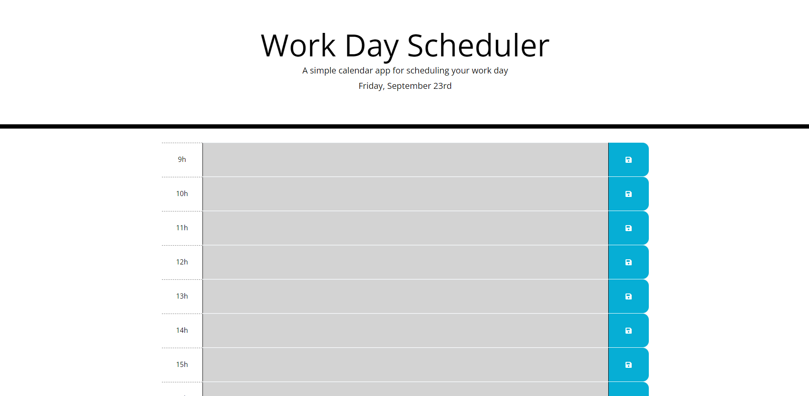

# Work Day Scheduler

## Description

This day planner is specifically targeted towards working individuals who have trouble managing their time. The planner is split up into 8 different sections, each corresponding to one hour of time in a 9h-17h work day. Daily tasks can be saved to this planner in order to help manage time and stay ontop of deadlines.

## Installation

No installation required, navigate to https://michaelsinn.github.io/day-planner/ to use the day planner.

## Usage

To use the day planner, navigate to https://michaelsinn.github.io/day-planner/. Once on the site, enter your hourly tasks by clicking on the center of a table row and typing. After the desired task has been added, make sure to press the save button for that row. Without pressing save, your tasks will be removed when you refresh or exit the page. Grey rows represent past time, red rows represent current time, and green rows represent future times.

The planner is setup to use 24 hour time.

## Credits

Michael Sinn - https://www.github.com/MichaelSinn
Xandromus - https://github.com/coding-boot-camp

## License

MIT License

Copyright (c) 2022 Michael Sinn

Permission is hereby granted, free of charge, to any person obtaining a copy
of this software and associated documentation files (the "Software"), to deal
in the Software without restriction, including without limitation the rights
to use, copy, modify, merge, publish, distribute, sublicense, and/or sell
copies of the Software, and to permit persons to whom the Software is
furnished to do so, subject to the following conditions:

The above copyright notice and this permission notice shall be included in all
copies or substantial portions of the Software.

THE SOFTWARE IS PROVIDED "AS IS", WITHOUT WARRANTY OF ANY KIND, EXPRESS OR
IMPLIED, INCLUDING BUT NOT LIMITED TO THE WARRANTIES OF MERCHANTABILITY,
FITNESS FOR A PARTICULAR PURPOSE AND NONINFRINGEMENT. IN NO EVENT SHALL THE
AUTHORS OR COPYRIGHT HOLDERS BE LIABLE FOR ANY CLAIM, DAMAGES OR OTHER
LIABILITY, WHETHER IN AN ACTION OF CONTRACT, TORT OR OTHERWISE, ARISING FROM,
OUT OF OR IN CONNECTION WITH THE SOFTWARE OR THE USE OR OTHER DEALINGS IN THE
SOFTWARE.